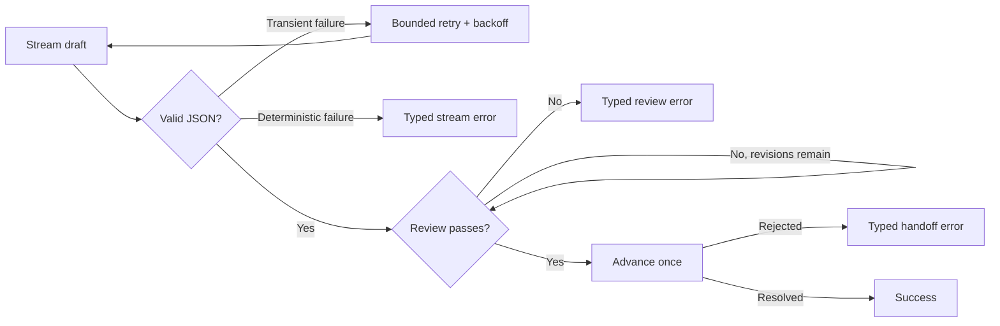

# ClickedOn AI-native engineering challenge

A completed TypeScript reliability challenge for a streamed content-generation pipeline.

The original pipeline worked on its happy path but lost failed handoffs, crashed on truncated model output, stopped on transient rate limits, and could revise forever. This submission makes every failure explicit and keeps retry behavior bounded.

## What changed

- Surfaces downstream handoff failures as typed `handoff` errors
- Retries truncated streams, HTTP 429 responses, and transient 5xx failures
- Uses bounded exponential backoff with an injectable sleep function
- Avoids retrying deterministic parse failures
- Caps the review loop at three revisions
- Converts reviewer exceptions into typed `review` failures
- Does not retry a handoff without an idempotency key, avoiding duplicate delivery

## Control flow



## Run the verification gates

Requires Node.js 22 or a compatible modern Node release.

```bash
npm ci
npm run typecheck
npm run lint
npm test
npm run build
```

The test suite covers:

1. failed handoffs;
2. recovery from a truncated first stream;
3. two consecutive rate limits followed by success; and
4. a reviewer that never accepts the draft.

## Design notes

`GenerateResult` carries the failure stage and original cause so callers can route or report errors without parsing messages. Stream retries are separated from the review loop, making the two budgets independently auditable. Handoffs remain single-attempt until the interface can carry an idempotency key.

## Stack

TypeScript · Vitest · ESLint · GitHub Actions
